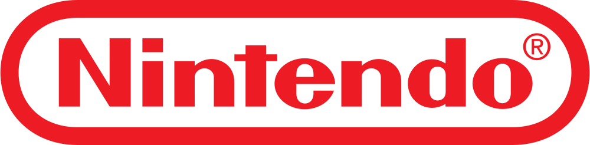

# nintendo-fan-website

This is an unofficial fan website dedicated to Nintendo, created by a passionate Nintendo enthusiast. Please note that this project is not affiliated with or endorsed by Nintendo Co., Ltd.

## Project Overview

This website provides information about Nintendo, its history, products, and more. It aims to celebrate the legacy and creativity of Nintendo in the world of gaming. The website includes sections on:

- About Nintendo
- Nintendo Products
- Contact Us

## Disclaimer

This project is created by a fan for fellow Nintendo fans. It does not claim to represent Nintendo in any official capacity. All copyrights, trademarks, and intellectual property rights related to Nintendo and its products are owned by Nintendo Co., Ltd.

## Usage

You are welcome to explore and use this website for informational purposes. Feel free to share it with fellow Nintendo enthusiasts. However, please keep in mind the following:

- Do not use Nintendo's trademarks, logos, or copyrighted material without permission.
- Respect copyright and intellectual property rights when sharing content related to Nintendo.
- This project is open source under the [MIT License](LICENSE). You can fork, modify, and share the code following the license terms.

## License

This project is licensed under the MIT License - see the [LICENSE](LICENSE) file for details.

---

*Disclaimer: This project is an unofficial fan project and is not affiliated with or endorsed by Nintendo Co., Ltd.*
